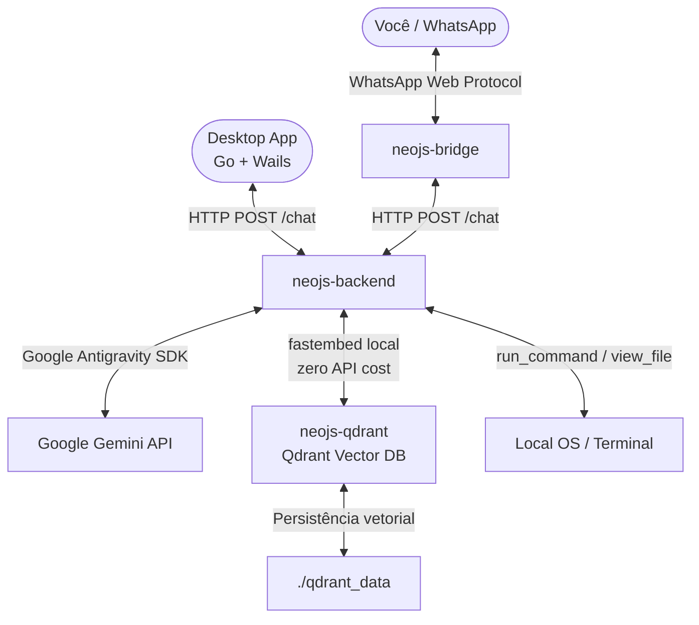

# Neo.JS - Seu Assistente Pessoal Sênior de Backpocket 🚀🐳🎙️


O **Neo** é um assistente pessoal autônomo local que conecta o seu WhatsApp diretamente ao shell do seu sistema operacional (**macOS** ou **Linux**). Ele é orgulhosamente impulsionado pela **Gemini Family** (utilizando o **Gemini 2.5 Flash** para máxima velocidade e economia), rodando sobre o **Google Antigravity SDK** como motor cognitivo para processar linguagem natural, escrever código, gerenciar arquivos e infraestrutura Docker.

> 🎙️ **Voz:** Envie um áudio (PTT) no WhatsApp para si mesmo e o Neo transcreve e executa automaticamente.
> 🖥️ **Desktop:** Interface nativa em Go+Wails com ícone na bandeja do sistema para Linux/Zorin OS.
> 📱 **Termux/SSH:** Converse com o Neo pelo terminal do celular — **sem depender do WhatsApp** (sem QR code, banimentos ou bridge).
> 🌍 **Fora de casa:** Acesse de qualquer lugar com **Tailscale** + SSH, sem abrir portas no roteador e sem expor o backend.
> 🧠 **Memória RAG:** Contexto semântico inteligente — o Neo lembra apenas do que é relevante, não de tudo.

### 👾 Aparência (Estilo Minecraft)

| Avatar do App / Tray | Corpo Inteiro |
|:---:|:---:|
|  |  |

---

## 💸 Economia Absurda (Powered by Gemini 2.5 Flash)

O Neo foi projetado para extrair o máximo de autonomia com o mínimo de custo. Ao adotar o **Gemini 2.5 Flash** no coração do Antigravity SDK, conseguimos derrubar o custo de operação para frações de centavos, tornando-o imbatível quando comparado a soluções como OpenClaw ou OpenDevin.

| Plataforma / Agente | Custo Médio por Ciclo Autônomo Completo (Pensar, Codar, Testar) |
|---|---|
| OpenClaw (GPT-4o) | ~ R$ 1,50 a R$ 2,50 |
| Agent Padrão (Gemini 1.5 Pro) | ~ R$ 0,15 a R$ 0,30 |
| **Neo.JS (Gemini 2.5 Flash)** | **~ R$ 0,02 (Dois Centavos!)** |

Isso significa que você tem um Engenheiro de Software autônomo à sua disposição no WhatsApp, capaz de criar e executar scripts inteiros, cobrando quase nada pelo serviço.

---

## 🏗️ Arquitetura

A arquitetura do Neo roda **nativamente**, sem depender de Docker, com serviços independentes:



### Como a memória funciona (RAG para diálogos)

Em vez de enviar **todo o histórico** da conversa a cada mensagem (crescimento quadrático de tokens 📈), o Neo usa uma abordagem **RAG (Retrieval-Augmented Generation)**:

```
ABORDAGEM TRADICIONAL (cara):
Msg 10 → [system] + msg1 + msg2 + ... + msg10  ← ~10.000 tokens

ABORDAGEM RAG DO NEO (eficiente):
Msg 10 → [system] + [top-3 turns relevantes] + msg10  ← ~2.000 tokens constantes
```

Cada turno de conversa é vetorizado **localmente** com `fastembed` (modelo `BAAI/bge-small`, roda dentro do Docker, sem custo de API) e armazenado no **Qdrant**. A cada nova mensagem, os 3 turnos semanticamente mais relevantes são recuperados e injetados como contexto.

### Serviços

| Serviço | Tecnologia | Porta | Função |
|---|---|---|---|
| `neojs-backend` | Python + FastAPI + Antigravity SDK | `5000` | Núcleo cognitivo do Neo |
| `neojs-bridge` | Node.js + whatsapp-web.js | `3303` | Bridge WhatsApp Web |
| `neojs-qdrant` | Qdrant (Rust) | `6333` / `6334` | Memória vetorial + Dashboard |
| `daemon` (optional) | Go + Wails | — | App desktop Linux/Zorin OS |

### Controle de custo de tokens

- **Sessão do Agent:** reseta automaticamente a cada **10 trocas**, evitando acúmulo de contexto
- **Embeddings locais:** `fastembed` roda offline dentro do container, **zero custo de API**
- **Score threshold:** turnos com relevância < 0.5 são ignorados (não poluem o contexto)
- **Limite de chars:** payload de cada turno armazenado é limitado a 1.000 chars

### 🔍 Qdrant Dashboard

Quando o Neo estiver rodando, acesse `http://localhost:6333/dashboard` para visualizar em tempo real os diálogos vetorizados, pontos armazenados e fazer buscas semânticas na memória do Neo.

### 🖥️ Daemon Desktop & Tray (Linux/Zorin OS)

Um **Daemon Desktop** nativo em Go e Wails adiciona uma camada de interface gráfica:

- **Instância Única:** Impede processos duplicados usando sockets Unix.
- **Menu da Bandeja:** Ícone ao lado do relógio para abrir o chat, configurações ou encerrar.
- **Fechar em Background:** O botão `X` oculta a janela sem matar o processo.
- **Configuração de API Key:** Adicione sua chave Gemini de forma segura pela UI.
- **Atalhos Globais:** Configure hotkeys globais pela interface.
- **Entrada por Voz:** Clique no microfone no chat para enviar comandos por áudio — transcrição automática via Gemini.

---

## 🛠️ Habilidades Principais

- **🎙️ Comandos por Voz:** Grave um áudio (PTT) no WhatsApp ou no app desktop — o Neo transcreve e executa.
- **🗣️ Síntese de Voz (TTS) Modular:** O Neo pode responder com áudio no WhatsApp! O sistema atual usa `gTTS` como fallback para respostas rápidas, mas a arquitetura em `tts_engine.py` já foi preparada para receber modelos de clonagem locais (ex: XTTS/Coqui TTS). **Colaboradores são bem-vindos para dar continuidade à integração de `.voicebox.zip` e outros motores pesados!**
- **🧠 Memória Semântica RAG:** Lembra conversas relevantes via busca vetorial no Qdrant (sem enviar tudo ao LLM).
- **⚙️ Execução Nativa:** Leve e rápido, roda diretamente no Linux, macOS e Windows sem depender de Docker.
- **💻 Engenharia de Software:** Expert sênior em PHP (Laravel), Node.js/TypeScript, Python e Flutter/Dart.
- **🛡️ Auto-Reparo (Self-Healing):** A bridge do WhatsApp atua como um sensor. Se o WhatsApp Web for atualizado e quebrar a conexão, o Neo detecta a falha, atualiza sua própria biblioteca (`whatsapp-web.js`) e reinicia de forma 100% autônoma!
- **🗜️ Headroom Proxy Integrado:** Otimização avançada de tokens interceptando a comunicação da SDK e comprimindo os prompts antes de chegar no Google Gemini, garantindo máxima economia no longo prazo.
- **🔒 Privacidade:** Processa apenas mensagens do Self-Chat (você para você mesmo).

---

## 💻 Instalação & Setup

### 🔑 Obtendo sua API Key do Gemini

#### 1. Google AI Studio (Grátis com limites)
1. Acesse [Google AI Studio](https://aistudio.google.com/) e faça login.
2. Clique em **Get API Key** > **Create API Key**.
3. Copie a chave (começa com `AIzaSy`).

> ⚠️ Chaves gratuitas têm limites de requisições por minuto. Para uso contínuo, recomendamos ativar faturamento.

#### 2. Google Cloud Console (Faturamento Ativo — Recomendado)
1. Acesse o [Google Cloud Console](https://console.cloud.google.com/).
2. Crie/selecione um projeto e ative o **Faturamento (Billing)**.
3. Vá em **APIs & Services > Library**, ative a **Generative Language API**.
4. Vá em **APIs & Services > Credentials** > **+ Create Credentials > API Key**.
5. *(Recomendado)* Restrinja a chave para a Generative Language API.

---

### 🚀 Instalação Rápida

```bash
git clone https://github.com/marcellopato/neo-js.git && cd neo-js && node install.js
```

O instalador interativo configura o `.env`, detecta versões antigas e oferece migração automática.

### 🖥️ Atalho `neo` no terminal (Step 5 do instalador)

O **Step 5** do instalador cria automaticamente o comando **`neo`** no seu
terminal. Depois de instalar, basta digitar `neo` em qualquer pasta para abrir
o Neo CLI (ele usa o Python do `venv` do projeto, sem depender de ativação
manual do ambiente).

O que é criado em cada plataforma:

| Plataforma | Arquivo(s) alterado(s) | O que é adicionado |
|---|---|---|
| **Linux** | `~/.zshrc`, `~/.bashrc` ou `~/.bash_profile`, fish `config.fish` | Alias `neo` → launcher `./neo` do projeto |
| **macOS** | `~/.zshrc`, `~/.bashrc` ou `~/.bash_profile`, fish `config.fish` | Alias `neo` → launcher `./neo` do projeto |
| **Windows** | `$PROFILE` do PowerShell 5.1 e 7 (`Documents\WindowsPowerShell` e `Documents\PowerShell`) | Função `neo` → `venv\Scripts\python.exe neo-cli.py` |

Detalhes importantes:

- **Idempotente:** o instalador marca o bloco com `# Neo CLI`; se o atalho já
existir, ele **não duplica nada** (mostra *"nada a fazer"*).
- **Windows + OneDrive:** se a pasta `Documents` estiver sincronizada no
OneDrive, a redireção é detectada e o `$PROFILE` correto é usado.
- Depois de instalar, **abra um terminal novo** (ou rode `source ~/.zshrc` no
Unix) para o atalho valer.

#### 🔧 Consertando um atalho quebrado

Se o comando `neo` parou de funcionar — por exemplo, depois de **mover o
projeto de pasta** (o atalho antigo continua apontando para o caminho anterior)
— o instalador regrava o atalho com o caminho atual:

```bash
# 1. Remova o bloco antigo (a partir do marcador "# Neo CLI") do seu shell config
#    ex.: ~/.zshrc, ~/.bashrc, ~/.bash_profile, config.fish ou $PROFILE

# 2. Rode o instalador de novo
node install.js

# 3. Abra um terminal novo (ou: source ~/.zshrc) e teste
neo
```

> ℹ️ O wizard é **interativo** — na re-execução, ele pergunta de novo sobre
> sobrescrever o `.env`, recriar o venv e configurar o systemd. Responda **`n`**
> para tudo isso (mantém seu `.env`/venv/serviço atuais); só o **Step 5** mexe
> no atalho.

> ⚠️ Como a checagem é **por marcador**, o instalador não sobrescreve um bloco
> existente mesmo que o caminho esteja desatualizado. Por isso, quando o
> projeto foi movido, apague o bloco antigo **antes** de rodar `node install.js`
> — assim ele regrava com o caminho novo.

### 🎬 Vídeo de Instalação

Prefere ver o fluxo em ação em vez de ler? Assista ao vídeo/GIF do processo
completo de instalação:

> ⏳ **Em breve.** O link do vídeo/GIF entra aqui:
>
> <!-- Para publicar: substitua o placeholder abaixo pela URL real.
>      GIF (renderiza inline): 
>      Vídeo mp4 (GitHub suporta a tag <video>):
>      <video src="URL_DO_VIDEO_MP4" controls></video> -->
>
> 

A versão em texto do passo a passo continua disponível (dobrada abaixo), caso
você prefira seguir por escrito:

<details>
<summary>📋 Instalação manual (versão em texto)</summary>

```bash
# 1. Configure o ambiente
cp .env.example .env
# Edite .env e preencha as variáveis como GEMINI_API_KEY

# 2. Inicie o sistema
# O script abaixo cuidará de instalar as dependências de Node e Python e iniciar os processos.
# No Linux / macOS:
chmod +x start.sh
./start.sh

# No Windows (PowerShell):
# Certifique-se de ter Node.js e Python instalados.
python -m venv venv
.\venv\Scripts\pip install -r requirements.txt
npm install
# Inicie o backend:
start /B .\venv\Scripts\python agent.py
# Inicie a bridge:
node bridge.js
```

</details>

---

## 🔄 Migração da versão anterior

Se você estava usando uma versão anterior (sem Docker ou com ChromaDB), rode:

```bash
chmod +x migrate.sh && ./migrate.sh
```

O script remove caches antigos (caso existam) e prepara o ambiente para rodar nativamente.

---

## 🚀 Rodando o Neo

```bash
./start.sh
```

Isso inicia o backend em background e a bridge (Node.js) em foreground.
No primeiro uso, o QR Code do WhatsApp Web aparecerá direto no seu terminal para você escanear.

**No Windows:**
```powershell
start /B .\venv\Scripts\python agent.py
node bridge.js
```

Para acessar o **Dashboard de Memória Vetorial**:
```
http://localhost:6333/dashboard
```

---

## 📱 Neo CLI — Controle o Neo pelo Terminal / Termux (SSH)

Além do WhatsApp e do app desktop, você pode conversar com o Neo direto do
terminal — inclusive **do celular via Termux**! O CLI usa os mesmos endpoints do
backend (`/chat/stream` com SSE, `/chat` de fallback e `/reset`), então nenhuma
configuração extra no servidor é necessária.

### 🎨 Boas-vindas com o ícone do Neo

O CLI abre com um banner **estilo neofetch** que mostra o próprio avatar do Neo
(gerado de `neo_head.png` em arte ASCII truecolor, com meio-blocos `▀`/`▄`)
ao lado de uma caixa de boas-vindas com o backend e as dicas:

```
▀▀▀▀▀▀▀▀▀▀▀▀▀▀▀▀▀▀▀▀   ╔═══════════════════════════════════╗
▀▀▀▀▀▀▀▀▀▀▀▀▀▀▀▀▀▀▀▀   ║ NEO CLI                           ║
▀▀▀▀▀▀▀▀▀▀▀▀▀▀▀▀▀▀▀▀   ║ seu agente direto no terminal     ║
▀▀▀▀▀▀▀▀▀▀▀▀▀▀▀▀▀▀▀▀   ║                                   ║
▀▀▀▀▀▀▀▀▀▀▀▀▀▀▀▀▀▀▀▀   ║ 👋 Olá! Eu sou o Neo.             ║
▀▀▀▀▀▀▀▀▀▀▀▀▀▀▀▀▀▀▀▀   ║ Me dê tarefas, comandos e         ║
▀▀▀▀▀▀▀▀▀▀▀▀▀▀▀▀▀▀▀▀   ║ perguntas — eu executo.           ║
▀▀▀▀▀▀▀▀▀▀▀▀▀▀▀▀▀▀▀▀   ║ Backend : http://127.0.0.1:5000   ║
▀▀▀▀▀▀▀▀▀▀▀▀▀▀▀▀▀▀▀▀   ║ 💡 /help  ·  /status  ·  /reset   ║
▀▀▀▀▀▀▀▀▀▀▀▀▀▀▀▀▀▀▀▀   ╚═══════════════════════════════════╝
```

> ✨ No terminal real o rosto do Neo aparece **colorido** (truecolor) — a arte
> é embutida no próprio `neo-cli.py`, então funciona no Termux sem dependências
extras.

### Na mesma máquina

```bash
./venv/bin/python neo-cli.py
# ou, se você instalou pelo Step 5:
neo
```

### No celular via SSH + Termux

O Termux é um terminal Linux completo para Android. Com ele, você tem a
mobilidade do WhatsApp **sem a fragilidade da bridge** (QR code, banimentos,
updates do whatsapp-web.js).

```bash
# 1. No Termux, instale os pacotes:
pkg install python openssh termux-api
pip install requests python-dotenv

# 2. SSH na máquina que roda o Neo (na mesma rede local):
ssh usuario@ip-do-neo

# 3. Rode o CLI (a partir do diretório do projeto):
python3 neo-cli.py
```

> ⚠️ **Segurança:** o backend escuta apenas em `127.0.0.1` (localhost), então
> conectar via SSH mantém tudo protegido. **Não exponha a porta 5000 na
> internet** — prefira SSH (local ou via Tailscale, abaixo).

### 🌍 Fora de casa — acesso remoto com Tailscale (sem WhatsApp)

Quando você está **na rua** (4G/5G, outro Wi-Fi), o `ip-do-neo` da rede local
não funciona mais. A melhor solução é o **Tailscale**: uma rede privada virtual
(WireGuard) entre seus dispositivos, que faz o celular enxergar a máquina do
Neo **de qualquer lugar do mundo** — sem configurar DNS público, sem abrir
porta no roteador e sem expor o backend à internet.

| Critério | Ngrok | Tailscale ✅ |
|---|---|---|
| Backend exposto na internet? | Pode expor a porta 5000 | **Nunca** (rede privada criptografada) |
| Nome/URL estável | Muda a cada reinício (plano grátis) | Fixo via MagicDNS |
| Precisa abrir porta no roteador? | Não | Não |
| Grátis | 1 túnel limitado | Até **100 dispositivos** |
| Aproveita a arquitetura SSH atual | Parcial | ✅ Totalmente |

```bash
# ── Na máquina que roda o Neo (uma vez) ──────────────────────────────
sudo tailscale up        # abre URL p/ autenticar com conta Google/GitHub
tailscale ip -4          # mostra o IP da tailnet (ex.: 100.x.x.x)

# ── No celular ─────────────────────────────────────────────────────────
# ⚠️ ATENÇÃO: `pkg install tailscale` NÃO existe no Termux (repositórios
#    próprios). Instale o APP Tailscale na Play Store / F-Droid e faça
#    login com a MESMA conta da máquina. O Termux usa a VPN do sistema
#    automaticamente — nenhum pacote extra dentro do Termux é necessário.

# ── No Termux, de qualquer lugar (4G/5G, café, viagem) ────────────────
ssh usuario@nome-da-maquina    # MagicDNS resolve o nome automaticamente
cd /caminho/para/neo-js        # diretório do projeto
./venv/bin/python neo-cli.py   # ou simplesmente: neo
```

> 💡 **Por que funciona:** você faz SSH na própria máquina e o CLI conversa com
> o backend em `127.0.0.1:5000` **localmente** — o Tailscale só substitui o
> "caminho até a máquina", e o backend continua invisível para a internet.
> Nenhuma configuração extra no servidor é necessária.

> 🔑 **Mesma conta:** a máquina e o celular precisam estar logados na **mesma
> conta** Tailscale, senão um não enxerga o outro.

### 🌟 Recursos exclusivos do Termux (auto-detectados)

| Recurso | Comando Termux usado | Como ativar |
|---|---|---|
| 🗣️ **Voz** — Neo lê as respostas em voz alta | `termux-tts-speak` | automático no Termux (desligue com `/voz off`) |
| 🎙️ **Comandos por voz** — grave no microfone e o Neo transcreve | `termux-microphone-record` + endpoint `/transcribe` | comando `/audio` |
| 🔐 **Aprovação de comandos** — notificação com botões Sim/Não | `termux-notification` | automático (fallback: digitar `sim`/`não` no terminal) |
| 📋 **Copiar resposta** para a área de transferência | `termux-clipboard-set` | comando `/copiar` |

### Comandos do REPL

```
/help          mostra esta ajuda
/status        mostra a configuração atual da sessão
/reset         reinicia o contexto de conversa do Neo
/voz on|off    liga/desliga a voz (Termux)
/audio         grava áudio do microfone e envia transcrito (Termux)
/copiar        copia a última resposta para a área de transferência (Termux)
/exit          sai do Neo CLI  (ou Ctrl+D)
```

### Como funciona a aprovação de comandos

Quando o Neo quer executar um comando potencialmente perigoso, o backend pede
autorização. No WhatsApp isso vai para o *self-chat* via `/ask` (porta 3303).
Com o Neo CLI, o próprio CLI sobe um mini-servidor na porta 3303 que responde
as aprovações: no Termux aparece uma **notificação com botões ✅ Sim / ❌ Não**;
fora do Termux, basta digitar `sim`/`não` no terminal.

Se a porta 3303 estiver ocupada pela bridge do WhatsApp, o CLI detecta e avisa
(as aprovações continuam indo pelo WhatsApp) — ou use `--ask-port` e aponte o
backend com a env `BRIDGE_PORT` para a mesma porta.

### Opções

```
python3 neo-cli.py [--backend URL] [--api-key KEY] [--ask-port PORTA]
                   [--no-stream] [--no-ask] [--no-voice]
```

Variáveis de ambiente: `NEO_BACKEND_URL` (default `http://127.0.0.1:5000`),
`NEO_GEMINI_API_KEY`, `NEO_ASK_PORT` (default 3303) e `NEO_VOICE`.
O `INTERNAL_API_KEY` do `.env` é usado para autenticação.

---

## 📦 Requisitos

- **Node.js** (v18+)
- **Python** (v3.10+)
- **Chave de API do Gemini** (Google AI Studio ou Google Cloud)

> Para o **Daemon Desktop** (Linux/Zorin OS): requer o binário `daemon` compilado com Go + Wails. Consulte `daemon/README.md`.

---

## 🤝 Contribuidores

O Neo.JS é uma iniciativa open-source e prospera graças à comunidade. Sinta-se à vontade para abrir Issues, enviar Pull Requests e sugerir novas integrações. 

- **Marcello Pato** - Idealizador e desenvolvedor principal.
- **Comunidade** - Junte-se a nós para transformar o Neo no agente de IA mais acessível do mundo!

---

*Desenvolvido com carinho para simplificar e turbinar a vida de desenvolvedores modernos.* 🚀💻
