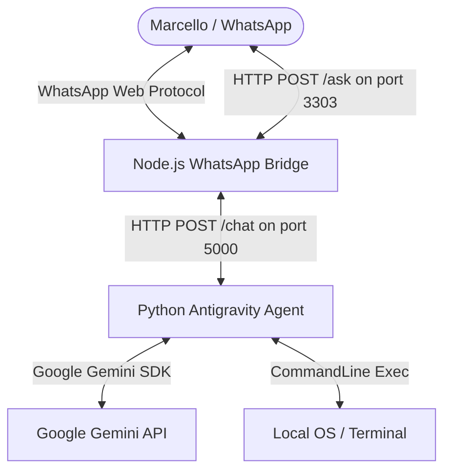

# Neo.JS - Seu Assistente Pessoal Sênior de Backpocket 🚀🐳🎙️

O **Neo** é um assistente pessoal autônomo local que conecta o seu WhatsApp diretamente ao shell do seu sistema operacional (**macOS** ou **Linux (Zorin OS)**). Ele utiliza o **Google Antigravity SDK** rodando sobre o **Gemini 2.0 Flash** como motor cognitivo avançado para processar linguagem natural, analisar seus códigos, gerenciar containers Docker e automatizar o seu terminal de desenvolvimento.

> 🎙️ **Novidade:** O Neo agora **ouve** seus áudios! Envie um comando por voz diretamente no WhatsApp (gravando um áudio/PTT para si mesmo) e o Neo transcreve e executa automaticamente usando o Gemini.

---

## 🏗️ Arquitetura Híbrida de Alta Robustez

Para garantir maior estabilidade e isolamento lógico, o Neo foi reestruturado em uma arquitetura híbrida de dois processos:



1. **Python Agent Backend (`agent.py`):** Controla o núcleo cognitivo usando o **Google Antigravity SDK**, avalia políticas de segurança para comandos shell e manipula arquivos locais de desenvolvimento.
2. **Node.js WhatsApp Bridge (`bridge.js`):** Gerencia a autenticação do WhatsApp Web (através do `whatsapp-web.js`), inicia o navegador headless do Puppeteer, ouve as mensagens exclusivas do chat privado e repassa ao Backend em Python.

---

## 🛠️ Habilidades Principais
- **🎙️ Comandos por Voz:** Grave um áudio (PTT) no WhatsApp para você mesmo e o Neo transcreve automaticamente com o **Gemini** e executa o comando — sem precisar digitar nada.
- **Orquestração de Máquina:** Gerenciamento do Docker, consulta de status e logs, manipulação avançada de arquivos locais no diretório de desenvolvimento (`~/Documentos/www`).
- **Engenharia de Software:** Expert sênior em **PHP (Laravel)**, **Node.js/TypeScript**, **Python** e **Flutter/Dart**.
- **Privacidade Extrema:** O Neo possui um filtro de retenção estrita. Ele **apenas** responde e processa comandos enviados por você para você mesmo (Self-Chat / contato "Você") e ignora completamente quaisquer grupos ou conversas de terceiros.
- **Camada de Consentimento Seguro:**
  - Comandos de **Leitura** (`ls`, `git status`, `cat`, `docker ps`, `logs`) são executados instantaneamente.
  - Comandos de **Alteração** (`rm`, `mv`, `docker-compose down`, `apt`, `brew`) são bloqueados por segurança; o Neo envia uma mensagem perguntando se você autoriza. Basta responder "Sim", "S" ou "OK" no WhatsApp para ele prosseguir.

---

## 💻 Instalação & Setup (macOS & Linux)

### 🚀 Atalho de Uma Única Linha (Instalador Inteligente)

Para facilitar ao máximo o compartilhamento com seus amigos, o Neo possui um **assistente interativo de instalação** desenvolvido em Node. 

Para baixar o código, configurar as dependências em Python (venv), instalar os pacotes do Node e configurar as opções de persistência automaticamente, basta que eles abram o terminal de preferência e colem **esta única linha**:

```bash
git clone https://github.com/marcellopato/neo-js.git && cd neo-js && node install.js
```

O assistente guiará o usuário passo a passo com uma interface bonita no terminal!

---

### 🛠️ Instalação Manual Passo a Passo (Alternativa)

### 1. Pré-requisitos mínimos
- **Node.js** (v18 ou superior)
- **Python** (v3.10 ou superior)
- Git instalado

### 2. Clonando e Configurando as Chaves
Duplique o arquivo `.env.example` para `.env` e preencha a sua chave da Gemini API:
```bash
cp .env.example .env
```
Abra o `.env` e configure:
```env
GEMINI_API_KEY=sua_completa_api_key_aqui
```

### 3. Configurando o Backend (Python)
Crie o ambiente virtual local, ative-o e instale as dependências:

*   **No macOS e Linux:**
    ```bash
    python3 -m venv venv
    source venv/bin/activate
    pip install -r requirements.txt
    ```
*   **No Windows:**
    ```bash
    python -m venv venv
    .\venv\Scripts\activate
    pip install -r requirements.txt
    ```

### 4. Configurando a Bridge (Node.js)
Abra outra aba no terminal (ou na própria raiz do projeto) e instale os pacotes npm:
```bash
npm install
```

---

## 🚀 Como Executar o Neo

### Método Unificado (Recomendado)
O projeto acompanha um script orquestrador universal chamado `start.sh` que inicia o backend do Python e a ponte do WhatsApp em concorrência, além de gerenciar o desligamento gracioso de ambos caso você pare o processo.

Dê permissão de execução e inicie:
```bash
chmod +x start.sh
./start.sh
```

### Método Manual (Para Debugging)
Se preferir debugar as duas aplicações de forma independente, abra duas abas de terminal:

*   **Aba 1 (Python Agent Backend):**
    ```bash
    source venv/bin/activate
    python agent.py
    ```
*   **Aba 2 (WhatsApp Bridge):**
    ```bash
    node bridge.js
    ```

> ⚠️ **Primeiro Acesso:** Ao iniciar a bridge pela primeira vez, um **QR Code** será desenhado no seu terminal. Escaneie-o usando o WhatsApp do celular (Aparelhos Conectados) para parear o agente.

---

## 🐳 Persistência nas Reinicializações do Sistema

Se você deseja que o Neo rode permanentemente em segundo plano e se inicie de forma automática com o boot da máquina:

### Opção A: No macOS (Usando PM2)
O PM2 é a solução ideal e robusta para persistir processos no macOS de forma extremamente prática:

1.  Instale o PM2 globalmente no seu Mac:
    ```bash
    npm install -g pm2
    ```
2.  Inicie o script unificado do Neo:
    ```bash
    pm2 start start.sh --name "neo-assistant"
    ```
3.  Configure-o para inicializar com o boot do macOS:
    ```bash
    pm2 startup
    # (Copie e execute o comando retornado no console para dar as permissões de sistema)
    pm2 save
    ```

### Opção B: No Linux (Usando systemd)
O projeto inclui um arquivo `neo.service` pronto.

1.  Ajuste os caminhos absolutos de usuário e diretório dentro do `neo.service` para os dados da sua máquina.
2.  Mova-o para as pastas do systemd e inicie:
    ```bash
    sudo cp neo.service /etc/systemd/system/
    sudo systemctl daemon-reload
    sudo systemctl enable neo.service
    sudo systemctl start neo.service
    ```
3.  Acompanhe os logs em tempo real usando:
    ```bash
    tail -f output.log
    ```

---
*Desenvolvido com carinho para simplificar e turbinar a vida de desenvolvedores modernos.* 🚀💻
