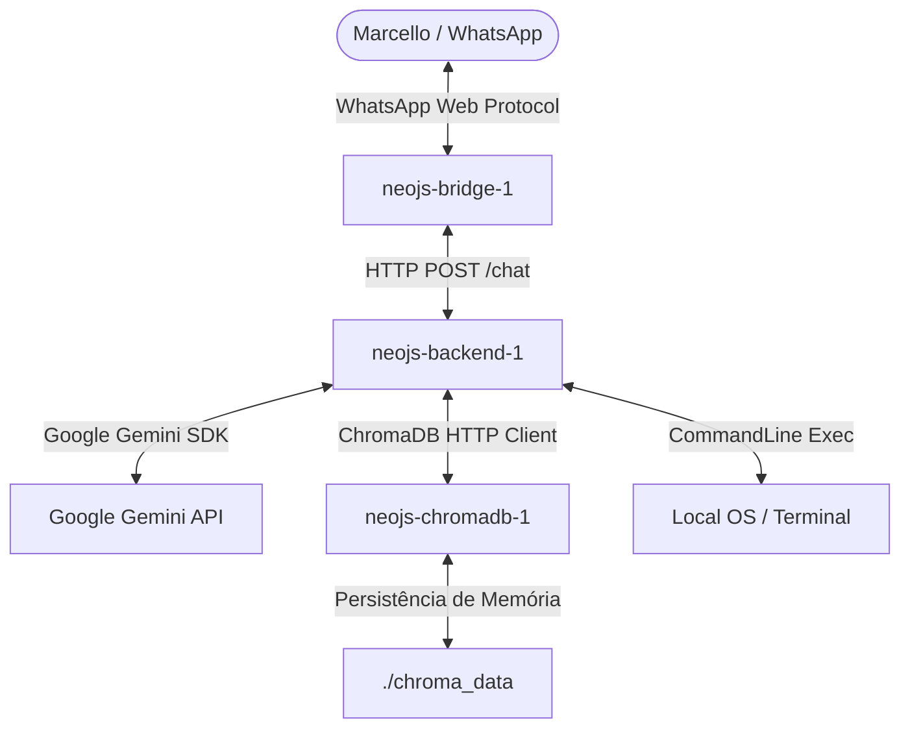

# Neo.JS - Seu Assistente Pessoal Sênior de Backpocket 🚀🐳🎙️

O **Neo** é um assistente pessoal autônomo local que conecta o seu WhatsApp diretamente ao shell do seu sistema operacional (**macOS** ou **Linux (Zorin OS)**). Ele é totalmente compatível e funciona de forma integrada com o **Antigravity CLI**, utilizando o **Google Antigravity SDK** rodando sobre o **Gemini 2.0 Flash** como motor cognitivo avançado para processar linguagem natural, analisar seus códigos, gerenciar arquivos locais, comandos e infraestrutura Docker.

> 🎙️ **Novidade:** O Neo agora **ouve** seus áudios! Envie um comando por voz diretamente no WhatsApp (gravando um áudio/PTT para si mesmo) e o Neo transcreve e executa automaticamente usando o Gemini.

---

## 🏗️ Arquitetura Híbrida em Docker (Nova Versão)

Para garantir máxima estabilidade e isolamento lógico, a arquitetura do Neo foi totalmente **Dockerizada** e orquestrada via `docker-compose`. Ela agora se apoia em 3 containers independentes:



1. **Python Agent Backend (`neojs-backend`):** Controla o núcleo cognitivo usando o **Google Antigravity SDK**.
2. **Node.js WhatsApp Bridge (`neojs-bridge`):** Gerencia a autenticação do WhatsApp Web e inicia o navegador headless seguro.
3. **ChromaDB (`neojs-chromadb`):** Banco de dados vetorial focado em manter uma **memória de longo prazo** para o Neo aprender e lembrar conversas e contextos passados.

---

## 🛠️ Habilidades Principais
- **🎙️ Comandos por Voz:** Grave um áudio (PTT) no WhatsApp para você mesmo e o Neo transcreve e executa o comando.
- **Memória Semântica:** Recorda conversas anteriores usando busca vetorial local via ChromaDB.
- **Orquestração de Máquina:** Gerenciamento do Docker, consulta de status e logs, manipulação avançada de arquivos locais.
- **Engenharia de Software:** Expert sênior em **PHP (Laravel)**, **Node.js/TypeScript**, **Python** e **Flutter/Dart**.
- **Privacidade Extrema:** O Neo processa apenas comandos enviados de você para você mesmo (Self-Chat / contato "Você").

---

## 💻 Instalação & Setup 

### 🚀 Instalação Rápida e Inteligente

O projeto vem com um assistente em Node.js (que requer que você tenha o Node instalado no Host apenas para a configuração inicial do `.env`). Para iniciar a instalação, basta executar:

```bash
git clone https://github.com/marcellopato/neo-js.git && cd neo-js && node install.js
```

> **Atenção:** Se você já tinha o Neo instalado em uma versão anterior (local/sem docker), o instalador irá detectar a versão antiga e sugerir a execução da **Migração**.

### 🔧 Instalação Manual
Se você prefere não usar o `install.js`:
1. Copie o arquivo `.env.example` para `.env` e configure sua chave de API (GEMINI_API_KEY).
2. Execute o orquestrador:
   ```bash
   ./start.sh
   ```
3. Acompanhe os logs para parear seu QR Code:
   ```bash
   docker compose logs -f bridge
   ```

---

## 🔄 Migração da versão Antiga para Docker

Se você estiver atualizando os arquivos do Github e já tinha sua sessão do WhatsApp salva no `.wwebjs_auth` localmente, ela será incompatível com a nova estrutura e entrará em loop de erro.
Para migrar sem problemas, rode o assistente de migração:

```bash
chmod +x migrate.sh
./migrate.sh
```
*O script de migração removerá as pastas de cache corrompidas e inicializará o Docker perfeitamente. Você terá que parear o WhatsApp escaneando o QR Code novamente.*

---

## 🚀 Como Executar o Neo

Sempre que precisar iniciar o Neo, basta rodar o comando:

```bash
./start.sh
```

Isso rodará o Docker Compose em modo daemon (`-d`), deixando o Neo silencioso trabalhando no background do seu computador.

---
*Desenvolvido com carinho para simplificar e turbinar a vida de desenvolvedores modernos.* 🚀💻
