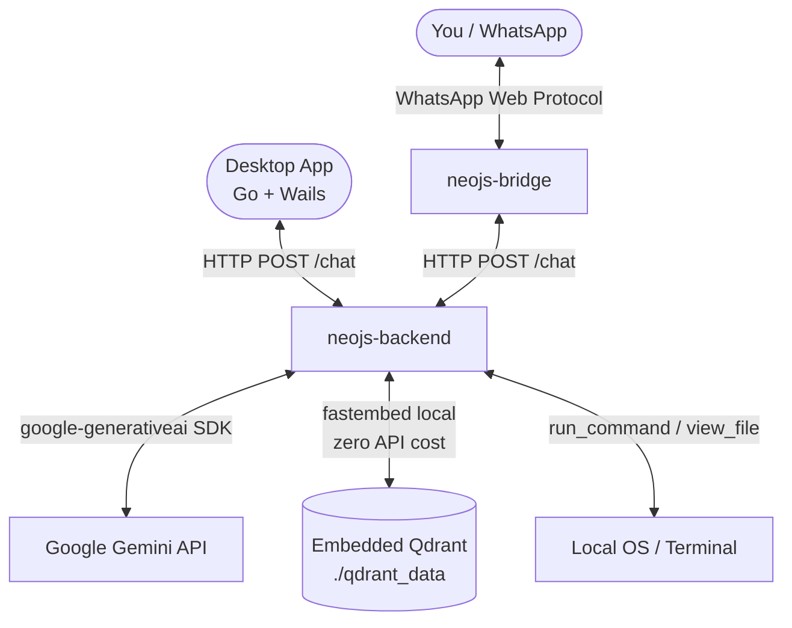
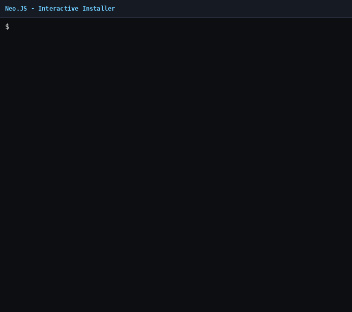

# Neo.JS — Your Senior Backpocket Personal Assistant 🚀🐳🎙️


**Neo** is an autonomous, local personal assistant that connects your WhatsApp directly to your operating system's shell (**macOS**, **Linux** or **Windows**). It is proudly powered by the **Gemini Family** — running **Gemini 2.5 Flash** for maximum speed and economy — through the **google-generativeai SDK** as its cognitive engine for natural-language processing, writing code, managing files and Docker infrastructure.

> 🎙️ **Voice:** Send an audio message (PTT) on WhatsApp to yourself and Neo transcribes and executes it automatically.
> 🖥️ **Desktop:** Native Go+Wails interface with a system-tray icon for Linux/Zorin OS.
> 📱 **Termux/SSH:** Chat with Neo from your phone's terminal — **no WhatsApp needed** (no QR code, bans or bridge).
> 🌍 **Away from home:** Access from anywhere with **Tailscale** + SSH, without opening router ports or exposing the backend.
> 🧠 **RAG memory:** Smart semantic context — Neo remembers only what's relevant, not everything.

### 👾 Look & Feel (Minecraft Style)

| App / Tray Avatar | Full Body |
|:---:|:---:|
|  |  |

---

## 💸 Absurd Cost Savings (Powered by Gemini 2.5 Flash)

Neo was designed to squeeze maximum autonomy out of minimum cost. By putting **Gemini 2.5 Flash** at the heart of the cognitive engine, we pushed operating costs down to fractions of a cent, making it unbeatable compared to solutions like OpenClaw or OpenDevin.

| Platform / Agent | Average Cost per Full Autonomous Cycle (Think, Code, Test) |
|---|---|
| OpenClaw (GPT-4o) | ~ $0.30 – $0.50 |
| Standard Agent (Gemini 1.5 Pro) | ~ $0.03 – $0.06 |
| **Neo.JS (Gemini 2.5 Flash)** | **~ $0.004 (half a cent!)** |

*Approximate values converted from BRL at ~R$5/US$.*

That means you have an autonomous Software Engineer at your disposal on WhatsApp, able to create and run entire scripts for almost nothing.

---

## 🏗️ Architecture

Neo runs **natively**, without relying on Docker, as independent services:



### How memory works (RAG for conversations)

Instead of sending the **entire history** of the conversation with every message (quadratic token growth 📈), Neo uses a **RAG (Retrieval-Augmented Generation)** approach:

```
TRADITIONAL APPROACH (expensive):
Msg 10 → [system] + msg1 + msg2 + ... + msg10  ← ~10,000 tokens

NEO'S RAG APPROACH (efficient):
Msg 10 → [system] + [top-3 relevant turns] + msg10  ← ~2,000 constant tokens
```

Each conversation turn is vectorized **locally** with `fastembed` (model `BAAI/bge-small-en-v1.5`, runs in-process, zero API cost) and stored in an **embedded Qdrant** instance under `./qdrant_data` — no Docker, no separate server. On every new message, the 3 most semantically relevant turns are retrieved and injected as context.

### Services

| Service | Technology | Port | Role |
|---|---|---|---|
| `neojs-backend` | Python + FastAPI + google-generativeai | `5000` | Neo's cognitive core |
| `neojs-bridge` | Node.js + whatsapp-web.js | `3303` | WhatsApp Web bridge (also serves `/ask` approvals) |
| Embedded Qdrant | Qdrant (in-process, `./qdrant_data`) | — | Vector memory, no server needed |
| `daemon` (optional) | Go + Wails + systray | — | Linux desktop app (Zorin OS) |

### Token cost control

- **Agent session:** the context resets automatically every **50 turns**, avoiding unbounded context growth
- **Local embeddings:** `fastembed` runs offline in-process — **zero API cost**
- **Score threshold:** turns with relevance < 0.5 are ignored (they don't pollute the context)
- **Char limit:** each stored turn's payload is capped at 1,000 chars
- **Rate limiting:** the backend limits each client to **10 requests/minute** (HTTP `429` beyond that)
- **Fallback chain:** if the Gemini quota is exhausted, the backend tries **Gemini 1.5 Flash** and then **Grok** (via optional `GROK_API_KEY`)

### 🗄️ Memory storage

Vectorized memories live in the local `./qdrant_data` folder (embedded Qdrant). There's no separate Qdrant server or dashboard — everything runs inside the backend process.

### 🖥️ Desktop Daemon & Tray (Linux/Zorin OS)

A native **Desktop Daemon** in Go + Wails adds a graphical layer:

- **Single Instance:** Prevents duplicate processes using Unix sockets.
- **Tray Menu:** Icon next to the clock to open the chat, settings or quit.
- **Close in Background:** The `X` button hides the window without killing the process.
- **API Key Configuration:** Add your Gemini key securely through the UI.
- **Global Hotkeys:** Configure global hotkeys from the interface.
- **Voice Input:** Click the microphone in the chat to send voice commands — automatic transcription.

---

## 🛠️ Main Skills

- **🎙️ Voice Commands:** Record an audio (PTT) on WhatsApp or the desktop app — Neo transcribes and executes it.
- **🗣️ Modular TTS (Speech Synthesis):** Neo can reply with audio on WhatsApp! The current system uses `gTTS` (pt-BR) for fast responses, but the architecture in `tts_engine.py` is ready to plug in local cloning models (e.g. XTTS/Coqui TTS). **Contributors are welcome to continue the `.voicebox.zip` integration and other heavy engines!**
- **🧠 Semantic RAG Memory:** Remembers relevant conversations via vector search in Qdrant (without sending everything to the LLM).
- **⚙️ Native Execution:** Lightweight and fast, runs directly on Linux, macOS and Windows without Docker.
- **💻 Software Engineering:** Senior expert in PHP (Laravel), Node.js/TypeScript, Python and Flutter/Dart.
- **🛡️ Auto-Repair (Self-Healing):** The WhatsApp bridge acts as a sensor. If WhatsApp Web updates and breaks the connection, Neo detects the failure, alerts itself to update its own library (`whatsapp-web.js`) and restarts — 100% autonomously.
- **🔒 Privacy:** Processes only Self-Chat messages (you to yourself).
- **😴 Lock System:** send `dormir` (or `lock`) on WhatsApp to put Neo to sleep; send your `NEO_PASSWORD` to unlock it again.

---

## 💻 Installation & Setup

### 🔑 Getting your Gemini API Key

#### 1. Google AI Studio (Free with limits)
1. Go to [Google AI Studio](https://aistudio.google.com/) and sign in.
2. Click **Get API Key** > **Create API Key**.
3. Copy the key (starts with `AIzaSy`).

> ⚠️ Free keys have per-minute request limits. For continuous use, we recommend enabling billing.

#### 2. Google Cloud Console (Billing enabled — Recommended)
1. Go to the [Google Cloud Console](https://console.cloud.google.com/).
2. Create/select a project and enable **Billing**.
3. Go to **APIs & Services > Library** and enable the **Generative Language API**.
4. Go to **APIs & Services > Credentials** > **+ Create Credentials > API Key**.
5. *(Recommended)* Restrict the key to the Generative Language API.

---

### 🚀 Quick Install

```bash
git clone https://github.com/marcellopato/neo-js.git && cd neo-js && node install.js
```

The interactive installer configures `.env`, detects old versions and offers automatic migration.

### 🖥️ The `neo` terminal shortcut (Step 5 of the installer)

**Step 5** of the installer automatically creates the **`neo`** command in your
terminal. After installing, just type `neo` in any folder to open the Neo CLI
(it uses the project's `venv` Python, no manual environment activation needed).

What gets created on each platform:

| Platform | File(s) changed | What is added |
|---|---|---|
| **Linux** | `~/.zshrc`, `~/.bashrc` or `~/.bash_profile`, fish `config.fish` | Alias `neo` → project launcher `./neo` |
| **macOS** | `~/.zshrc`, `~/.bashrc` or `~/.bash_profile`, fish `config.fish` | Alias `neo` → project launcher `./neo` |
| **Windows** | PowerShell 5.1 and 7 `$PROFILE` (`Documents\WindowsPowerShell` and `Documents\PowerShell`) | Function `neo` → `venv\Scripts\python.exe neo-cli.py` |

Important details:

- **Idempotent:** the installer marks the block with `# Neo CLI`; if the shortcut
already exists, it **doesn't duplicate anything** (shows *"nothing to do"*).
- **Windows + OneDrive:** if the `Documents` folder is synced to OneDrive, the
redirection is detected and the correct `$PROFILE` is used.
- After installing, **open a new terminal** (or run `source ~/.zshrc` on
Unix) for the shortcut to take effect.

#### 🔧 Fixing a broken shortcut

If the `neo` command stopped working — for example, after **moving the project
to another folder** (the old shortcut still points to the previous path) — the
installer rewrites the shortcut with the current path:

```bash
# 1. Remove the old block (from the "# Neo CLI" marker) in your shell config
#    e.g. ~/.zshrc, ~/.bashrc, ~/.bash_profile, config.fish or $PROFILE

# 2. Run the installer again
node install.js

# 3. Open a new terminal (or: source ~/.zshrc) and test
neo
```

> ℹ️ The wizard is **interactive** — on re-runs it asks again about
> overwriting `.env`, recreating the venv and configuring systemd. Answer **`n`**
> to all of those (keeps your current `.env`/venv/service); only **Step 5**
> touches the shortcut.

> ⚠️ Because the check is **marker-based**, the installer won't overwrite an
> existing block even if the path is outdated. So when the project has been
> moved, delete the old block **before** running `node install.js` — this way it
> rewrites with the new path.

### 🎬 Installation Video

Prefer to watch the flow instead of reading? Check out the GIF below with the
complete installation process:



> 💡 This GIF was recorded from the **real installer** (`node install.js`) in an
> isolated sandbox. Want to re-record it after changing the installer? Run
> `scripts/record-install-demo.sh`.

The text version of the step-by-step is still available (folded below) in case
you prefer to follow it in writing:

<details>
<summary>📋 Manual installation (text version)</summary>

```bash
# 1. Configure the environment
cp .env.example .env
# Edit .env and fill in the variables such as GEMINI_API_KEY

# 2. Start the system
# The script below installs the Node and Python dependencies and starts the processes.
# On Linux / macOS:
chmod +x start.sh
./start.sh

# On Windows (PowerShell):
# Make sure you have Node.js and Python installed.
python -m venv venv
.\venv\Scripts\pip install -r requirements.txt
npm install
# Start the backend:
start /B .\venv\Scripts\python agent.py
# Start the bridge:
node bridge.js
```

</details>

---

## 🔄 Migrating from a previous version

If you were using an older version (without Docker or with ChromaDB), run:

```bash
chmod +x migrate.sh && ./migrate.sh
```

The script removes old caches (if any) and prepares the environment to run natively.

---

## 🚀 Running Neo

```bash
./start.sh
```

This starts the backend (`agent.py`) and the bridge (`bridge.js`) **in the
background**, both logging to `backend.log` and `output.log` respectively.
On first use, the WhatsApp Web QR code is printed to `output.log` — watch it
with:

```bash
tail -f output.log
```

**On Windows:**
```powershell
start /B .\venv\Scripts\python agent.py
node bridge.js
```

---

## 📱 Neo CLI — Control Neo from the Terminal / Termux (SSH)

Besides WhatsApp and the desktop app, you can chat with Neo directly from the
terminal — including **from your phone via Termux**! The CLI uses the same
backend endpoints (`/chat/stream` with SSE, `/chat` fallback and `/reset`), so
no extra server configuration is needed.

### 🎨 Welcome banner with the Neo avatar

The CLI opens with a **neofetch-style** banner showing Neo's own avatar
(generated from `neo_head.png` as truecolor ASCII art, with half-blocks
`▀`/`▄`) next to a welcome box with the backend and tips:

```
▀▀▀▀▀▀▀▀▀▀▀▀▀▀▀▀▀▀▀▀   ╔═════════════════════════════════════════╗
▀▀▀▀▀▀▀▀▀▀▀▀▀▀▀▀▀▀▀▀   ║ NEO CLI                                 ║
▀▀▀▀▀▀▀▀▀▀▀▀▀▀▀▀▀▀▀▀   ║ your agent straight from the terminal   ║
▀▀▀▀▀▀▀▀▀▀▀▀▀▀▀▀▀▀▀▀   ║                                         ║
▀▀▀▀▀▀▀▀▀▀▀▀▀▀▀▀▀▀▀▀   ║ 👋 Hi! I'm Neo.                         ║
▀▀▀▀▀▀▀▀▀▀▀▀▀▀▀▀▀▀▀▀   ║ Give me tasks, commands and             ║
▀▀▀▀▀▀▀▀▀▀▀▀▀▀▀▀▀▀▀▀   ║ questions — I'll run them.              ║
▀▀▀▀▀▀▀▀▀▀▀▀▀▀▀▀▀▀▀▀   ║ Backend : http://127.0.0.1:5000         ║
▀▀▀▀▀▀▀▀▀▀▀▀▀▀▀▀▀▀▀▀   ║ 💡 /help  ·  /status  ·  /reset         ║
▀▀▀▀▀▀▀▀▀▀▀▀▀▀▀▀▀▀▀▀   ╚═════════════════════════════════════════╝
```

> ✨ In a real terminal Neo's face appears **colored** (truecolor) — the art is
> embedded inside `neo-cli.py`, so it works on Termux with no extra dependencies.

### On the same machine

```bash
./venv/bin/python neo-cli.py
# or, if you installed via Step 5:
neo
```

### On your phone via SSH + Termux

Termux is a full Linux terminal for Android. With it, you get WhatsApp-like
mobility **without the bridge's fragility** (QR code, bans, whatsapp-web.js
updates).

```bash
# 1. In Termux, install the packages:
pkg install python openssh termux-api
pip install requests python-dotenv

# 2. SSH into the machine running Neo (same local network):
ssh user@neo-ip

# 3. Run the CLI (from the project directory):
python3 neo-cli.py
```

> ⚠️ **Security:** the backend listens only on `127.0.0.1` (localhost), so
> connecting via SSH keeps everything protected. **Don't expose port 5000 to the
> internet** — prefer SSH (local or via Tailscale, below).

### 🌍 Away from home — remote access with Tailscale (no WhatsApp)

When you're **on the road** (4G/5G, another Wi-Fi), the local-network
`neo-ip` no longer works. The best solution is **Tailscale**: a private virtual
network (WireGuard) between your devices that makes your phone see the Neo
machine **from anywhere in the world** — no public DNS setup, no router port
forwarding and no backend exposure to the internet.

| Criterion | Ngrok | Tailscale ✅ |
|---|---|---|
| Backend exposed to the internet? | May expose port 5000 | **Never** (encrypted private network) |
| Stable name/URL | Changes on every restart (free plan) | Fixed via MagicDNS |
| Need to open a router port? | No | No |
| Free | 1 limited tunnel | Up to **100 devices** |
| Leverages the current SSH setup | Partially | ✅ Fully |

```bash
# ── On the machine running Neo (once) ────────────────────────────────
sudo tailscale up        # opens URL to authenticate with Google/GitHub account
tailscale ip -4          # shows the tailnet IP (e.g. 100.x.x.x)

# ── On the phone ───────────────────────────────────────────────────────
# ⚠️ ATTENTION: `pkg install tailscale` does NOT exist in Termux (own
#    repositories). Install the Tailscale APP from Play Store / F-Droid and
#    log in with the SAME account as the machine. Termux uses the system VPN
#    automatically — no extra package inside Termux is needed.

# ── In Termux, from anywhere (4G/5G, coffee shop, travel) ──────────────
ssh user@machine-name    # MagicDNS resolves the name automatically
cd /path/to/neo-js       # project directory
./venv/bin/python neo-cli.py   # or simply: neo
```

> 💡 **Why it works:** you SSH into the machine itself and the CLI talks to the
> backend at `127.0.0.1:5000` **locally** — Tailscale only replaces the "path to
> the machine", and the backend stays invisible to the internet. No extra server
> configuration is needed.

> 🔑 **Same account:** the machine and the phone must be logged into the **same
> Tailscale account**, otherwise they can't see each other.

### 🌟 Termux-only features (auto-detected)

| Feature | Termux command used | How to enable |
|---|---|---|
| 🗣️ **Voice** — Neo reads responses aloud | `termux-tts-speak` | automatic on Termux (turn off with `/voz off`) |
| 🎙️ **Voice commands** — record from the mic and Neo transcribes | `termux-microphone-record` + `/transcribe` endpoint | `/audio` command |
| 🔐 **Command approval** — notification with Yes/No buttons | `termux-notification` | automatic (fallback: type `yes`/`no` in the terminal — `sim`/`não` also work) |
| 📋 **Copy response** to the clipboard | `termux-clipboard-set` | `/copiar` command |

### REPL commands

```
/help          shows this help
/status        shows the current session configuration
/reset         resets Neo's conversation context
/voz on|off    turns voice on/off (Termux)
/audio         records mic audio and sends it transcribed (Termux)
/copiar        copies the last response to the clipboard (Termux)
/exit          exits the Neo CLI  (or Ctrl+D)
```

### How command approval works

When Neo wants to run a potentially dangerous command, the backend asks for
authorization. On WhatsApp this goes to the *self-chat* via `/ask` (port 3303).
With the Neo CLI, the CLI itself starts a mini-server on port 3303 that handles
the approvals: on Termux a **notification with ✅ Yes / ❌ No buttons** appears;
outside Termux, just type `yes`/`no` in the terminal (`sim`/`não` also work for
backwards compatibility).

If port 3303 is already taken by the WhatsApp bridge, the CLI detects it and
warns you (approvals keep going through WhatsApp) — or use `--ask-port` and
point the backend to the same port with the `BRIDGE_PORT` env var.

### Options

```
python3 neo-cli.py [--backend URL] [--api-key KEY] [--ask-port PORT]
                   [--no-stream] [--no-ask] [--no-voice]
```

Environment variables: `NEO_BACKEND_URL` (default `http://127.0.0.1:5000`),
`NEO_GEMINI_API_KEY`, `NEO_ASK_PORT` (default 3303) and `NEO_VOICE`.
The `INTERNAL_API_KEY` from `.env` is used for authentication.

### 🔑 Environment variables (`.env`)

| Variable | Required | Description |
|---|---|---|
| `GEMINI_API_KEY` | ✅ | Main Gemini key (Google AI Studio or Cloud) |
| `INTERNAL_API_KEY` | ✅ | Internal secret used for auth between services (`X-Neo-Token` header) |
| `NEO_PASSWORD` | ✅ | Password that unlocks Neo on WhatsApp (see the lock system below) |
| `GROK_API_KEY` | ⬜ Optional | Emergency fallback when the main Gemini quota runs out |
| `BRIDGE_HOST` / `BRIDGE_PORT` | ⬜ Optional | Where to reach the approval service (default `localhost:3303`) |
| `NEO_VOICE_ENABLED` | ⬜ Optional | Enables/disables TTS replies (default `true`) |

---

## 📦 Requirements

- **Node.js** (v18+)
- **Python** (v3.10+)
- **Gemini API key** (Google AI Studio or Google Cloud)

> For the **Desktop Daemon** (Linux/Zorin OS): requires the `daemon` binary compiled with Go + Wails. See `daemon/README.md`.

---

## 🤝 Contributors

Neo.JS is an open-source initiative that thrives thanks to the community. Feel free to open Issues, send Pull Requests and suggest new integrations.

- **Marcello Pato** — Creator and lead developer.
- **Community** — Join us in turning Neo into the most accessible AI agent in the world!

---

*Made with love to simplify and supercharge the life of modern developers.* 🚀💻
